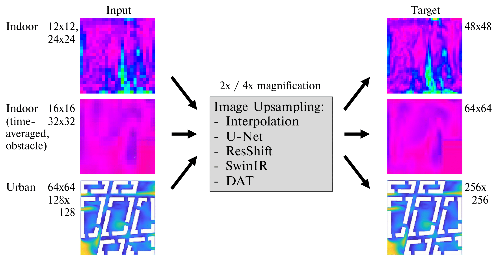
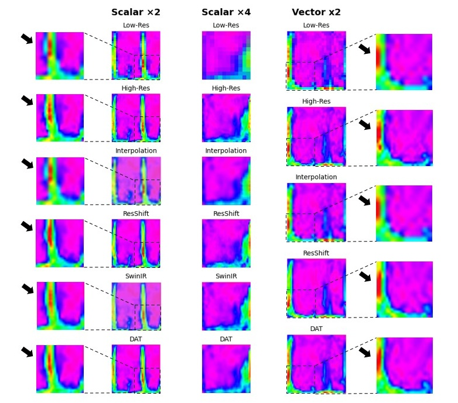
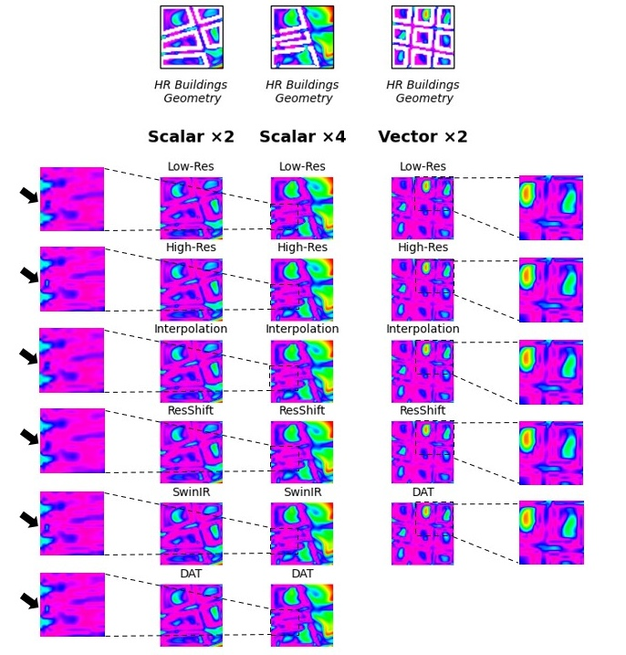

# Physics-Informed Deep Learning for Super-Resolution of Indoor and Outdoor Airflow: 


---
> Numerical modeling of turbulent airflow with Computational Fluid Dynam-
ics (CFD) requires expertise and a substantial amount of computation power.
Yet, CFD simulations are considered vital for assessing novel architectural
and urban ventilation concepts. As a potential remedy, image upsampling
techniques from computer vision can help in significantly reducing necessary
computing times while maintaining high prediction accuracy. Hereby, low
resolution CFD simulations are provided as inputs to prediction models for
upsampling towards high-fidelity flow fields. Several recent studies focus-
ing on the built environment propose various upsampling approaches using
Deep Learning (DL). However, they are either constrained to well specified
domains, or they use one of the many existing DL architectures without con-
clusive findings on how model prediction accuracy relates to airflow domain
characteristics. This paper therefore complements the existing literature by
comparing several state-of-the-art DL architectures applied to a range of air-
flow setups, including forced indoor ventilation, as well as urban air flow.
Results reveal that sparsity of the flow domain exhibits a limiting factor
for upsampling techniques, even if complemented with physics informed loss
terms to maintain physical coherence. On the other hand, pronounced and
heterogeneous flow fields can be upsampled well even to a magnification fac-
tor of 4, and modern DL architectures based on vision transformers and
diffusion models clearly outperform canonical CNN models such as U-Net.. 
>

---

### Visualization Results: Indoor and Outdoor airflow

|Indoor Airflow| Outdoor Airflow |
|----------------|----------------|
|  |  |


### VISION TRANSFORMERS

## Requirements
To run the Vision TRANSFORMERS you need to create a conda enviroment with python 3.8. Therefore run the following commands:
```
conda create -n Upsampling python=3.8
conda activate Upsampling
pip install -r requirements.txt
python setup.py develop
```

### Training
To train the different models, run the following commands. You may need to change the `dataroot_H`, `dataroot_L`, `scale factor`, etc. in the json or yaml file for different settings. 
All the configs files are under the folder `options`.

```python
# SwinIR model
##X2 magnification factor
python -m torch.distributed.launch --nproc_per_node=1 --master_port=1234 main_train_SwinIR.py --opt options/options_SwinIR /train_swinir_sr_classicalx2.json  --dist True 
##X4 magnification factor
python -m torch.distributed.launch --nproc_per_node=1 --master_port=1234 main_train_SwinIR.py --opt options/options_SwinIR/train_swinir_sr_classicalx4.json  --dist True 

# DAT model
##X2 magnification factor
python -m torch.distributed.launch --nproc_per_node=1 --master_port=4321 basicsr/train.py -opt options/options_DAT/Train/train_DAT_2_x2.yml --launcher pytorch
##X4 magnification factor
python -m torch.distributed.launch --nproc_per_node=1 --master_port=4321 basicsr/train.py -opt options/options_DAT/Train/train_DAT_2_x4.yml --launcher pytorch
```

### Testing
To test the models use this commands:
```python
# SwinIR model
python main_test_SwinIR.py --task classical_sr --scale (scale) --training_patch_size 32 --model_path superresolution/swinir_sr_x2_Obstacles/models/80000_G.pth --folder_lq datasets/dataset_obstacles/dataset_csv_Y_all_cases/test/LW --folder_gt datasets/dataset_obstacles/dataset_csv_Y_all_cases/test/HR

# DAT model
##X2 magnification factor
python -m torch.distributed.launch --nproc_per_node=1 --master_port=4321 basicsr/test.py -opt options/options_DAT/Test/test_DAT_2_x2.yml --launcher pytorch
##X4 magnification factor
python -m torch.distributed.launch --nproc_per_node=1 --master_port=4321 basicsr/test.py -opt options/options_DAT/Test/test_DAT_2_x2.yml --launcher pytorch
```

### DIFFUSION MODEL

## Requirements
The ResShift model requires a different configuration, for this reason you need to create another conda enviroment with a higher version of python.
```
conda create -n ResShift python=3.12
conda activate ResShift
pip install -r requirements_ResShift.txt
```

You will also have to downaload the weights of the autoencoder from the google Drive folder and place it in a folder named `weights` as a subfolder of the top-directory.

### Training
To train the different models, run the following commands. You may need to change the `dir_paths`, for both validation and trainign and for validation also use `extra_dir_paths`.
All the configs files are under the folder `options`.

```python
##X2 magnification factor
CUDA_VISIBLE_DEVICES=0 torchrun --standalone --nproc_per_node=1 --nnodes=1 main.py --cfg_path options/options_ResShift/realsr_swinunet_x2.yaml --save_dir  output_dir
##X4 magnification factor
CUDA_VISIBLE_DEVICES=0 torchrun --standalone --nproc_per_node=1 --nnodes=1 main.py --cfg_path options/options_ResShift/realsr_swinunet_x4.yaml --save_dir  output_dir
```


### Testing
To test the models use this command:
```python
python inference_customModel.py    --in_path  data/dataset_vectors/validation/lw     --out_path infereceResut_physics/no_physics_Vector_x2_time    --ckpt_path /home/vittorio/Scrivania/ResShift_4_scale/models_trained_no_physcs/no_physics_Vector_x2/ckpts/model_75000.pth     --config_path configs/realsr_swinunet_realsrgan48.yaml     --scale 2/4    --chop_size 64     --chop_stride 64     --bs 1     --task realsr
```

If you need further instruction here are listed the original repositories: \
[SwinIR](https://github.com/JingyunLiang/SwinIR) \
[DAT](https://github.com/zhengchen1999/DAT) \
[ResShift](https://github.com/zsyOAOA/ResShift)